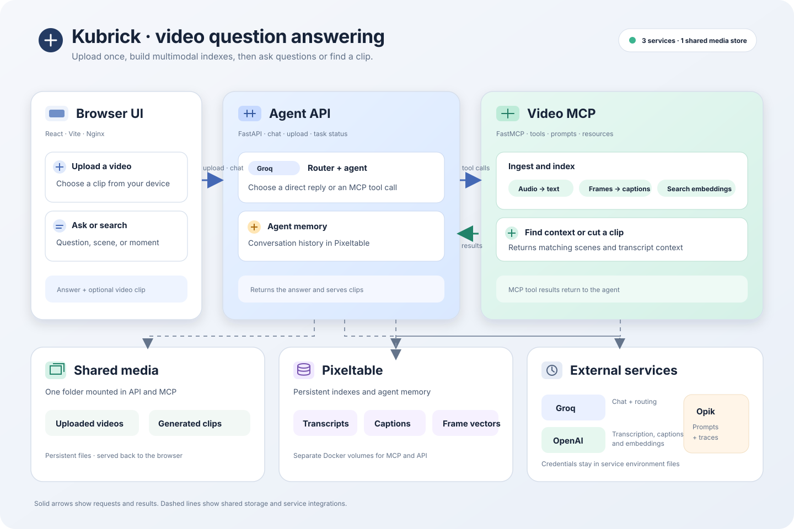

# Kubrick: multimodal video assistant

Kubrick is a video question-answering application. Upload a video, ask questions about its contents, and request relevant clips through a chat interface.

This repository is a modified derivative of the Kubrick project; see [NOTICE](NOTICE) for attribution.

## How it works

The application runs as three Docker Compose services:

- **Web UI** (`kubrick-ui`): React interface for chat and video uploads.
- **Agent API** (`kubrick-api`): FastAPI service that routes questions to an LLM and calls MCP tools.
- **Video MCP server** (`kubrick-mcp`): indexes video frames and audio, then exposes search and clip tools to the agent.

Uploaded media is shared between the API and MCP containers. Pixeltable databases are stored in Docker volumes.

### Architecture

The diagram below shows how uploads and questions move through the UI, agent API, and video MCP server, along with the shared media, indexes, and external services.



## Requirements

- Docker Desktop or Docker Engine with the Compose plugin
- An OpenAI API key for video transcription, captioning, and embeddings
- A Groq API key for the chat agent
- An Opik API key and workspace for MCP prompt management

API usage may incur charges with OpenAI and Groq.

## Run locally

Clone the repository:

```bash
git clone https://github.com/paavni24/video-rag-agent.git
cd video-rag-agent
```

Create the environment files:

```bash
cp .env.example .env
cp kubrick-api/.env.example kubrick-api/.env
cp kubrick-mcp/.env.example kubrick-mcp/.env
```

Fill in the keys in `kubrick-api/.env` and `kubrick-mcp/.env`. Keep these files private; they are ignored by Git. The API file needs `GROQ_API_KEY` and may include Opik settings. The MCP file needs `OPENAI_API_KEY`, `OPIK_API_KEY`, `OPIK_WORKSPACE`, and `OPIK_PROJECT`.

The database volumes are marked external in the supplied Compose file. Create them once on a fresh machine, then start the app:

```bash
docker volume create kubrick_api_pixeltable
docker volume create kubrick_mcp_pixeltable
mkdir -p shared_media kubrick-mcp/.records
make start-kubrick
```

Open **http://localhost:3000**. The API docs are at **http://localhost:8080/docs**. The MCP endpoint is **http://localhost:9090/mcp**; it speaks the MCP protocol and is not a browser page.

Stop the services with:

```bash
make stop-kubrick
```

The video databases are in Docker volumes. Uploaded videos are in `shared_media/`. Back up both before removing volumes or moving the project to another machine.

## Prompts

The MCP server keeps local default prompts in `kubrick-mcp/src/kubrick_mcp/prompts.py`. When the API requests a prompt, the server checks Opik first and creates the default there if one does not exist. An existing Opik prompt takes precedence over the local default.

## Deployment note

The current UI uses `http://localhost:8080` for API requests, so it is configured for local use. For a public deployment, change the UI to use a same-origin API path and add a reverse proxy, or configure the UI with the deployed API URL. Keep the API and MCP services private behind HTTPS.

## License and attribution

This project is distributed under the Apache License 2.0; see [LICENSE](LICENSE) and [NOTICE](NOTICE) for the original project attribution.
